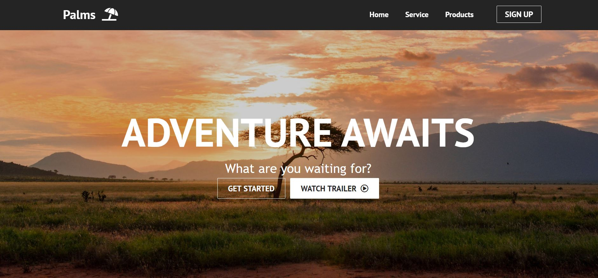
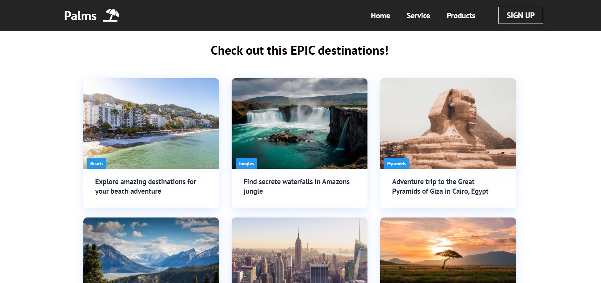
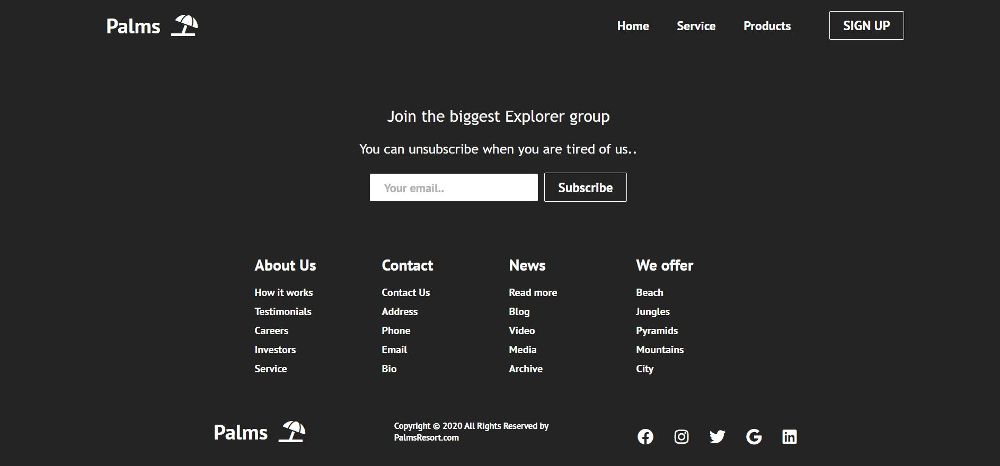

<h1>Simple Webpage created with react.</h1>

 Front-end for representative type tour operator web page. Made using React front-end. Classic CSS for styling page. Use font awesome icons for icon elements. React router to switch between pages.

<h5>Check link hosted with netlify:  <a href="https://palmresort.netlify.app/" target="_blank">https://palmresort.netlify.app/</a>  </h5>
 

